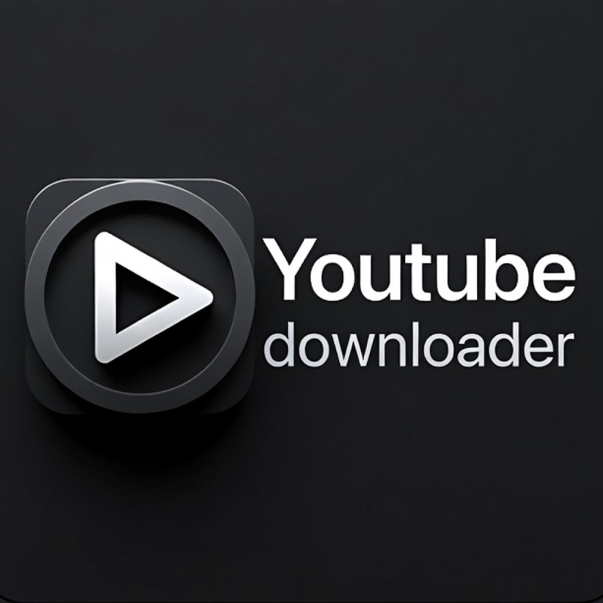

# 📺 YouTube Downloader for macOS

A premium, modern, and powerful YouTube Downloader application built for macOS. Download videos, audio, and playlists with ease using a beautiful dark-themed interface.



## ✨ Features

*   **🎨 Premium UI/UX**: Modern, dark-themed interface with smooth animations and a professional look.
*   **🚀 Three Powerful Modes**:
    *   **⚡️ Simple (MVP)**: Quick and easy downloads. Just paste the link and go.
    *   **🛠 Advanced**: Full control. Choose resolution (up to 4K), format (MP4/MP3), and download subtitles in multiple languages.
    *   **playlist Playlist**: Download entire playlists with a single click. Select specific videos or download all at once.
*   **🍎 Native macOS Experience**: Installs directly to your `/Applications` folder via a standard `.pkg` installer.
*   **🛠 Automatic Setup**: Automatically handles dependencies like FFmpeg, so you don't have to.
*   **📝 Metadata & Subtitles**: Preserves video metadata and supports downloading subtitles in English, Russian, Uzbek, and more.
*   **⚡️ Fast Downloads**: Powered by `yt-dlp` for maximum speed and reliability.

## 📥 Installation

### Option 1: Install via PKG (Recommended)

1.  Download the latest **`YouTube Downloader.pkg`** from the releases page.
2.  Double-click the `.pkg` file to launch the installer.
3.  Follow the prompts to install.
4.  Open **YouTube Downloader** from your **Applications** folder or Launchpad.

### Option 2: Run from Source

If you prefer to run the application from the source code:

1.  **Clone the repository**:
    ```bash
    git clone https://github.com/azimxxm/Flet-Youtube-Downloader-App.git
    cd Flet-Youtube-Downloader-App
    ```

2.  **Run the application**:
    ```bash
    python3 run.py
    ```
    *The application will automatically check for and install necessary dependencies (Flet, yt-dlp, FFmpeg) on the first run.*

## 🛠 Tech Stack

*   **Language**: Python 3.10+
*   **UI Framework**: [Flet](https://flet.dev) (Flutter for Python)
*   **Core Engine**: [yt-dlp](https://github.com/yt-dlp/yt-dlp)
*   **Media Processing**: FFmpeg
*   **Packaging**: `pkgbuild` (macOS)

## 📸 Screenshots

| Simple Mode | Advanced Mode | Playlist Mode |
|:-----------:|:-------------:|:-------------:|
| *(Screenshot)* | *(Screenshot)* | *(Screenshot)* |

## 🤝 Contributing

Contributions are welcome! Please feel free to submit a Pull Request.

## 📄 License

This project is licensed under the MIT License - see the [LICENSE](LICENSE) file for details.

---
*Built with ❤️ by Azimjon*
